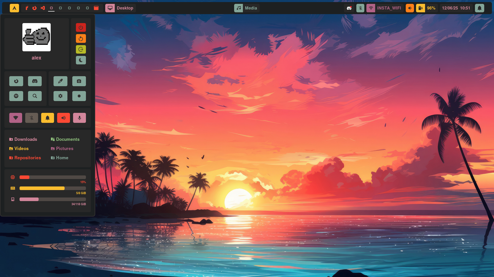

# Hyprland Dotfiles

Welcome to my collection of dotfiles for [Hyprland](https://github.com/hyprwm/Hyprland), a dynamic tiling Wayland compositor. This repository contains my personal configuration files, scripts, and setup instructions to help you get started with a customized Hyprland environment on Arch Linux.



## Features

- Pre-configured Hyprland setup for productivity and aesthetics
- Custom keybindings and workspace management
- Theming for a consistent look and feel
- Integration with essential tools and utilities

## Installation

> **Info:**  
> The installation script will automatically install [gum](https://github.com/charmbracelet/gum) and [yay](https://github.com/Jguer/yay) before proceeding with the rest of the setup.

To quickly set up your environment with these dotfiles, run:

```shell
curl -sSL https://raw.githubusercontent.com/ASauvage/my_nixos/main/install.sh | bash
```

This script will automate the installation and configuration process.

## Requirements

- [Arch Linux](https://archlinux.org/)
- Hyprland
- Git

## Customization

Feel free to modify the configuration files to suit your workflow and preferences.

## License

This project is licensed under the MIT License.